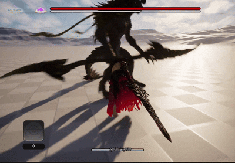
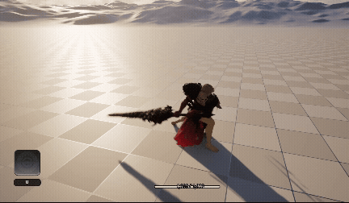
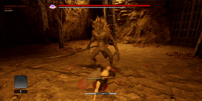

# First Berserker : Khazan 팀프로젝트 모작

> Unreal Engine 5 기반 3인칭 소울라이크 액션 게임


## 프로젝트 소개

퍼스트 버서커: 카잔의 전투 시스템을 참고하여 제작한 3인칭 소울라이크 액션 게임입니다.

플레이어 전투 시스템 전반을 담당하였으며, 락온, 회피, 가드, 패링(저스트 가드), 차지 공격, 피격 반응 등 핵심 전투 기능을 C++로 구현했습니다.

### 개발 정보

| 항목    | 내용                   |
| ----- | -------------------- |
| 개발 기간 | 2026.05              |
| 개발 인원 | 5인 팀 프로젝트            |
| 담당 역할 | 플레이어 전투 시스템 구현       |
| 개발 환경 | Unreal Engine 5, C++ |

---

# 주요 기능

## Lock-On System


* 주변 적 탐색 및 락온
* 플레이어 회전 방향 제어
* 카메라 시점 동기화

## Guard & Parry



* 가드 상태 전환
* 저스트 가드 판정
* Camera Shake 피드백

## Charge Attack



* 입력 유지 시간 측정
* 일반 공격 / 차지 공격 분기
* Animation Montage 기반 구현

## Hit Reaction



* 피격 상태 전환
* 피격 애니메이션 재생
* 행동 제한 처리

---

# 플레이어 시스템 구조

```text
Player Character

├─ Movement
│   ├─ Move
│   └─ Dodge
│
├─ Lock-On System
│
├─ Combat
│   ├─ Attack
│   ├─ Charge Attack
│   ├─ Guard
│   └─ Parry
│
├─ Damage System
│
└─ Hit Reaction
```

---

# 주요 구현 내용

### 데미지 전달 인터페이스 설계

공격 객체가 피해 대상의 구체적인 타입을 알지 못해도 데미지를 전달할 수 있도록 인터페이스 기반 데미지 처리 시스템을 구현했습니다.

### 상태 기반 액션 시스템

이동, 회피, 가드, 패링, 피격 등의 상태를 관리하여 전투 상황에 맞는 행동을 수행하도록 구현했습니다.

### 애니메이션 연동

Animation Montage를 활용하여 일반 공격, 차지 공격, 피격 반응을 자연스럽게 연결했습니다.

---

# 트러블슈팅

### Git 병합 충돌 경험

프로젝트 후반부에 플레이어 클래스와 애니메이션 관련 파일에서 병합 충돌이 빈번하게 발생했습니다.

이를 통해 기능 단위 브랜치 전략과 협업 프로세스의 중요성을 경험했습니다.

---

# 프로젝트 문서

* 시연 영상 : [YouTube 링크](https://www.youtube.com/watch?v=Hcxf33EmYe4)
